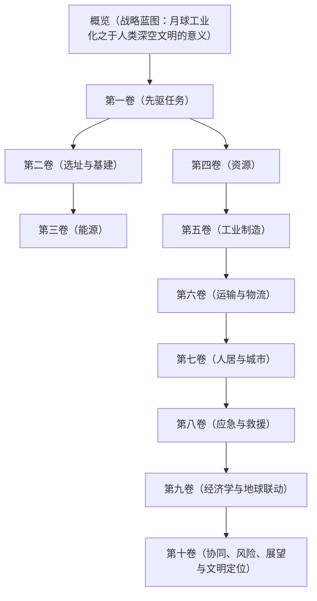

# 附册一：月球工业

## 概览：战略蓝图与演进阶段

**版本**：1.1 
**编制日期**：2026年5月 
**货币单位**：人民币（元），符号：¥ 
**前置阅读**：主册《概览》、《第二卷》（材料科学）、《第八卷》（运输与物流）

### 一、为什么是月球：独立于环梯的文明级工程

在《太空环梯工程》主册中，月球被设定为环梯CNT缆绳的“加速选项”供应地。然而，这种功能性的定位远远低估了月球工业化的根本价值。本附册开宗明义，确立一个比肩甚至超越环梯工程本身的战略判断：

> **月球工业化是人类文明从“行星文明”迈向“空间文明”不可逾越的第一步。它不是任何超级工程的附属品，而是所有后续深空工程（包括环梯）能够从“宏伟”走向“可持续”的物质与能量基石。**

将月球仅仅视为一个原料开采地，就如同将工业革命时期的北美大陆仅仅视为英国的棉花产地，是对其历史地位的根本性误判。月球具备地球无法提供的、开启全新文明形态的关键要素：

1. **战略位置与引力势能**：位于地球引力井边缘，拥有仅为地球1/6的表面重力。从月面进入地月空间或更远深空所需的能量远低于从地球发射，这使其成为人类探索和开发太阳系的天然“前哨站”和“跳板”。

2. **近乎无限的清洁能源**：月面太阳能无大气衰减、无阴雨天气；极区永昼峰（Peak of Eternal Light）可提供近乎连续不间断的太阳能。远期，月壤中丰富的氦-3资源为可控核聚变提供了关键燃料，有望一劳永逸地解决人类的终极能源问题。

3. **完整的工业原料**：月壤和月岩是经过数十亿年小行星撞击和太阳风洗礼的“精矿”。它富含氧、硅、铁、铝、钛等关键工业元素，可通过原位资源利用技术提炼，为建造大型空间设施（包括环梯的GEO前哨站乃至环梯本身）提供几乎无限的结构材料。

4. **独特的物理环境**：高真空、低温、低重力环境为材料科学、生物制药、高能物理等前沿科学提供了地球上无法复现的理想实验场和制造车间。

因此，月球工程不是因为环梯工程才存在；恰恰相反，环梯工程是月球工业体系成熟后，人类能够建造的第一个、也是最宏伟的“深空基础设施产品”之一。本附册的使命，是勾勒出这个独立工业文明从零到一、从弱到强的完整路径。

### 二、核心战略目标

本附册规划的月球工业体系，旨在实现以下四个层层递进的战略目标：

1. **生存与自持**：建立不依赖地球持续大规模补给的永久性载人基地，实现水、氧气和基本食物的闭环循环。

2. **建设与自造**：掌握月面大规模基建能力，并能利用月面本地资源制造结构性材料（金属、混凝土），实现基地的自主扩建和维修。

3. **制造与输出**：完成从“自造”到“智造”的跨越，具备生产如CNT缆绳、高纯度晶体、特种合金等非月面独有不可的高端产品，并以此为拳头产品，融入并主导地月经济圈。

4. **复制与独立**：形成能够自我复制和迭代升级的“工业母机”体系。从冶炼炉到芯片厂，全产业链本地化，使月球社会能独立于地球的技术供应链而存续和发展，最终成为一个繁荣的、自给自足的“地外文明节点”。

### 三、核心论证范围

本附册不满足于概念阐述，而是对以下问题进行严谨的工程化论证：

- **在哪建？** 给出基于综合评分模型的最优选址方案。
- **怎么活？** 提出闭合式生态生命支持系统和辐射防护的具体工程方案。
- **怎么造？** 设计从月壤提炼到高端制造的全链路工业流程与关键技术参数。
- **怎么运？** 规划从月面到整个地月空间的低成本、高效率物流网络。
- **怎么赚？** 建立独立且能融入地球经济的商业模式，分析其投入产出与投资回报。

### 四、整体演进阶段

月球工业化是一个跨越数十年的宏大征程，本附册将其划分为四个逻辑清晰、目标明确的演进阶段：

| 阶段 | 名称 | 核心目标 | 标志性节点 | 大致时间（从项目启动计） |
|:---:|:---|:---|:---|:---:|
| **第一阶段** | **先驱任务与驻留** | 完成资源详查与关键技术月面验证，实现人类短、中期驻留。 | 建成小型月面实验站；驻留时间突破一个月。 | 第1–8年 |
| **第二阶段** | **前哨站与基础工业** | 建成永久性基地，掌握基础结构材料（金属、混凝土）的月面制造。 | 首个永久性月面建筑落成；首批月面制造的建材用于基地扩建。 | 第5–15年 |
| **第三阶段** | **工业基地与初步闭环** | 高端制造能力突破，实现关键工业品（如CNT缆绳）的量产与出口。 | 月面超级工厂投产；开始为空间大型设施稳定供货。 | 第12–25年 |
| **第四阶段** | **月球城市与文明节点** | 全产业链本地化，社会自持，成为独立、繁荣的地外文明中心。 | 建成万人级月球城市；形成自我循环的独立经济体。 | 第25年起 |

### 五、附册一卷册结构

为全面覆盖上述内容，本附册采用与主册类似的体例，分为十卷：

- **概览**（本卷）：月球工业的战略愿景、阶段划分与工程蓝图。
- **第一卷：先驱任务与在轨验证**：关键技术攻关与首次驻留任务。
- **第二卷：永久性基地选址与基础设施建设**：永久性基地选址、设计、建筑与交通网络。
- **第三卷：能源体系**：从核电到光伏，再到氦-3终极能源的全过程。
- **第四卷：原位资源利用与全资源开发**：全资源普查、原位利用与大规模采矿工程。
- **第五卷：制造体系**：从初级冶炼到CNT缆绳、芯片等高端产品的超级工厂。
- **第六卷：运输网络**：月面-月轨-地月空间的立体物流系统。
- **第七卷：人居与城市**：从研究站到万人级月球城市的生态、文化与治理。
- **第八卷：应急、防护与救援**：月球基地的六级风险预警与三层灾害隔离体系。
- **第九卷：经济学与地球联动**：商业模式、投入产出模型与地月共生经济。
- **第十卷：协同、风险、展望与文明定位**：与环梯工程的协同策略、独立生存能力评估与风险应对。

### 六、附册一与主册的接口关系

| 附册一卷号 | 与主册的协同关系 | 对接的主册卷号 |
|:---|:---|:---|
| **第一卷（先驱任务）** | 月面原位CNT制造、核电源、水冰开采等P0级验证，为主册第二卷CNT制造路径提供月面环境可行性数据 | 主册第二卷（材料）、第七卷（工程核验） |
| **第二卷（选址与基建）** | 选址决策直接影响主册第八卷“月球至GEO”走廊的发射场位置和物流成本 | 主册第八卷（运输） |
| **第三卷（能源）** | 空间太阳能发电方案与主册第九卷环上太阳能电站互为备份与补充 | 主册第九卷（能源与通信） |
| **第四卷（资源与采矿）** | 水冰开采能耗数据支撑主册第八卷“月球至GEO”走廊的推进剂补给方案；氦-3资源数据为主册远期能源方案提供参考 | 主册第八卷（运输） |
| **第五卷（制造）** | 输出CNT量产方案与产能爬坡计划，作为主册环建造的“加速选项”输入 | 主册第二卷（材料）、第八卷（运输） |
| **第六卷（运输）** | 规划月面至GEO物流走廊，为主册提供具体运输技术、成本和时间节点 | 主册第八卷（运输） |
| **第七卷（人居与城市）** | 闭合生态系统（CELSS）的工程参数为主册第十二卷环上居住舱的生命支持系统设计提供参考基线 | 主册第十二卷（应急、冗余与生命线工程） |
| **第八卷（应急与救援）** | 六级风险体系与三层灾害隔离体系为主册第十二卷“三层防灾体系”提供月面场景的工程实例 | 主册第十二卷（应急、冗余与生命线工程） |
| **第九卷（经济与地球联动）** | 融资方案与保险机制与主册第十卷（环梯经济模型）和第十一卷（UNORE治理框架）互为借鉴和补充 | 主册第十卷（经济）、第十一卷（治理） |
| **第十卷（协同与展望）** | 两条时间线的协同模型（黄金窗口第15–22年）直接输出至主册第八卷（建造时间线）和第十卷（经济模型），月球多元收入源为主册提供风险对冲分析 | 主册第八卷（运输）、第十卷（经济） |
| **全附册** | 附册一中所有待验证项，统一纳入主册第七卷的P0/P1/P2/P3优先级排序体系 | 主册第七卷（工程核验） |

### 七、逻辑关系图

### 八、参考文献

本附册各卷详细内容及技术参数，见本附册第一卷至第十卷。
