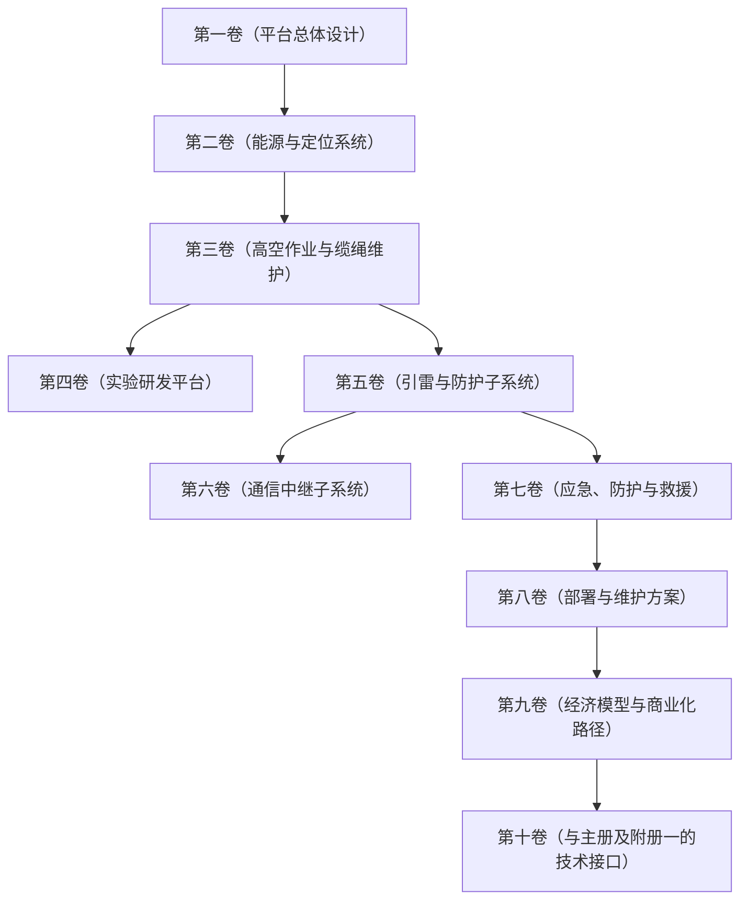

# 附册二：浮空平台

**版本**：1.4 
**编制日期**：2026年6月 
**货币单位**：人民币（元），符号：¥ 
**关联主册**：主册第三卷、第四卷、第五卷、第七卷、第九卷、第十卷、第十二卷 
**前置阅读**：主册《概览》、附册一《月球工业》

### 附册定位

> 本附册是《太空环梯工程》主册的平行配套方案，但其定位并非主册的附属，而是一个具备多元客户与独立盈利能力的高空驻留基础设施体系。浮空平台通过平流层飞艇或系留气球在20–50 km高度长期驻留，并搭载可在0–100 km任意高度沿缆绳攀爬作业的维修吊舱，搭载多样化载荷，服务于环梯养护、科学观测、通信中继、防灾预警及高空实验等多种需求。
>
> 在环梯体系中，浮空平台是大气层段（0–100 km）养护、维修、救援及雷电防护的核心执行者。但在更广泛的商业图景中，环梯只是浮空平台最大、最近的一个客户，而非其存续的前提。浮空平台在气象监测、通信中继及新材料测试等领域的独立商业价值，使其本身即构成一个值得投资的高价值项目，同时也是环梯工程控制风险的关键冗余。

### 卷册逻辑关系图

### 目录

- **概览：高空驻留基础设施体系**
  - 一、为什么是浮空平台：填补大气层长期驻留的空白
  - 二、核心战略目标
  - 三、核心论证范围
  - 四、整体演进阶段
  - 五、附册二卷册结构
  - 六、附册二与主册及附册一的接口关系

- **第一卷：平台总体设计**
  - 1.1 卷首说明
  - 1.2 平台功能定位与总体架构
  - 1.3 浮空器方案
  - 1.4 作业吊舱
  - 1.5 系留缆绳材料与锚碇方案
  - 1.6 无锚碇纯动力位置保持方案
  - 1.7 参数输出
  - 1.8 第一卷结语

- **第二卷：能源与定位系统**
  - 2.1 卷首说明
  - 2.2 柔性薄膜太阳能电池阵列
  - 2.3 激光/微波传能接收系统
  - 2.4 储能系统
  - 2.5 吊舱供电方案
  - 2.6 导航定位系统
  - 2.7 能源管理与分配
  - 2.8 参数输出
  - 2.9 第二卷结语

- **第三卷：高空作业与缆绳维护**
  - 3.1 卷首说明
  - 3.2 日常巡检设备与方案
  - 3.3 预防性维护工具与流程
  - 3.4 故障抢修能力与操作程序
  - 3.5 人员救援程序与逃生系统
  - 3.6 参数输出
  - 3.7 第三卷结语

- **第四卷：实验研发平台**
  - 4.1 卷首说明
  - 4.2 大气科学实验模块
  - 4.3 材料暴露与寿命评估模块
  - 4.4 高空生物实验模块
  - 4.5 技术验证模块
  - 4.6 环梯工程缩比实验
  - 4.7 参数输出
  - 4.8 第四卷结语

- **第五卷：引雷与防护子系统**
  - 5.1 卷首说明
  - 5.2 引雷方案比选与选型依据
  - 5.3 先导触发引雷装置设计
  - 5.4 雷电流导入与地面耗散网络
  - 5.5 平台自身雷电防护
  - 5.6 雷暴预警与安全降高程序
  - 5.7 待验证项汇总
  - 5.8 设备清单与质量估算
  - 5.9 参数输出
  - 5.10 第五卷结语

- **第六卷：通信中继子系统**
  - 6.1 卷首说明
  - 6.2 通信需求分析
  - 6.3 对地通信链路设计
  - 6.4 与环梯骨干网的接口设计
  - 6.5 平台间通信（多平台协同）
  - 6.6 对地广播与导航增强信号
  - 6.7 作业吊舱通信链路
  - 6.8 数据存储与延迟容忍网络（DTN）
  - 6.9 设备清单与质量估算
  - 6.10 功耗估算
  - 6.11 参数输出
  - 6.12 第六卷结语

- **第七卷：应急、防护与救援**
  - 7.1 卷首说明
  - 7.2 风险识别与分级
  - 7.3 分级预警与响应体系
  - 7.4 专项应急预案
  - 7.5 人员紧急撤离程序
  - 7.6 应急物资与设备配置
  - 7.7 灾后评估与恢复
  - 7.8 培训与演练
  - 7.9 参数输出
  - 7.10 第七卷结语

- **第八卷：部署与维护方案**
  - 8.1 卷首说明
  - 8.2 地面锚碇与收放系统
  - 8.3 定期降回地面检修流程
  - 8.4 多平台协同编队与冗余配置
  - 8.5 平台全生命周期维护计划
  - 8.6 部署流程（首次）
  - 8.7 参数输出
  - 8.8 第八卷结语

- **第九卷：经济模型与商业化路径**
  - 9.1 卷首说明
  - 9.2 分阶段投资模型
  - 9.3 收入来源与市场规模预测
  - 9.4 投资回报分析
  - 9.5 融资方案
  - 9.6 独立于环梯的存续能力
  - 9.7 风险与应对
  - 9.8 与主册第十卷的接口说明
  - 9.9 参数输出
  - 9.10 第九卷结语

- **第十卷：与主册及附册一的技术接口**
  - 10.1 卷首说明
  - 10.2 与主册第三卷（节点选址与锚碇工程）的接口
  - 10.3 与主册第四卷（电梯缆绳与轨道套）的接口
  - 10.4 与主册第五卷（电梯爬升器/轿厢）的接口
  - 10.5 与主册第七卷（工程核验）的接口
  - 10.6 与主册第九卷（能源与通信基础设施）的接口
  - 10.7 与主册第十卷（经济模型）的接口
  - 10.8 与主册第十二卷（应急、冗余与生命线）的接口
  - 10.9 与附册一（月球工业）的接口
  - 10.10 接口参数总表
  - 10.11 第十卷结语

### 附册二与主册及附册一的接口关系

| 附册二卷号 | 与主册/附册一的协同关系 | 对接的卷号 |
|:---|:---|:---|
| **第一卷（平台设计）** | 平台总体尺寸、升降机构与主册第四卷轨道套外径、齿条模数兼容 | 主册第四卷 |
| **第二卷（能源定位）** | 激光传能接收端与主册第五卷链路兼容；光伏电池与附册一第三卷共用技术 | 主册第五卷、附册一第三卷 |
| **第三卷（养护救援）** | 巡检数据输入主册第七卷待验证项；救援逃生舱与主册第十二卷“全员避险”协议衔接 | 主册第七卷、第十二卷 |
| **第四卷（实验研发）** | 环梯缩比实验直接对接主册P0级待验证项，为全尺寸建造提供实测数据 | 主册第四、五、七卷 |
| **第五卷（引雷防护）** | 引雷平台与主册第三卷锚碇地面站安全距离协同；雷电防护体系与主册第七卷三层防御体系整合 | 主册第三卷、第七卷 |
| **第六卷（通信中继）** | 通信中继与主册第九卷环上DWDM光纤骨干网频率协调；导航增强与主册第九卷GNSS差分校正协同 | 主册第九卷 |
| **第七卷（应急救援）** | 浮空平台应急体系与主册第十二卷“三层防灾体系”及“全员避险”协议对接；与附册一第八卷六级预警体系互为参考 | 主册第十二卷、附册一第八卷 |
| **第八卷（部署维护）** | 地面锚碇与主册第三卷节点航站楼的空间协调 | 主册第三卷 |
| **第九卷（经济模型）** | 作为独立投资项目的经济分析；服务合同覆盖多元客户；融资方案与主册第十卷、附册一第九卷共享主权基金和多边银行渠道 | 主册第十卷、附册一第九卷 |
| **第十卷（技术接口）** | 全附册技术接口索引，确保各卷之间的机械、电气、通信接口无冲突 | 主册及附册一各相关卷 |
